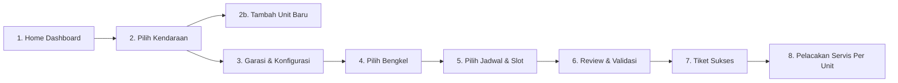

# 🛠️ ServisinAja — Multi-Vehicle Service Booking App

> **Technical Assessment Submission**  
> Solusi aplikasi pemesanan servis kendaraan bermotor dengan fitur unggulan **Multi-Vehicle Booking**, konfigurasi servis independen per unit, validasi kapasitas bengkel berbasis batch, dan pelacakan status pengerjaan (*live service tracking*) multi-unit secara paralel.

---

## 📌 Ringkasan Masalah & Solusi Produk

Dalam layanan servis kendaraan konvensional, pengguna yang memiliki lebih dari satu kendaraan (misal: 1 mobil keluarga dan 1 motor harian) terpaksa melakukan proses booking berulang kali. Hal ini menimbulkan friksi tinggi, waktu terbuang, dan jadwal kedatangan yang terpisah.

**ServisinAja** menghadirkan solusi terintegrasi:
1. **Multi-Vehicle Selection & Configuration**: Memilih beberapa unit sekaligus, mengonfigurasi jenis servis, spare part/oli, serta keluhan mekanik yang berbeda untuk tiap kendaraan dalam satu alur terpadu.
2. **Batch Capacity Validation**: Sistem penjadwalan pintar yang memvalidasi sisa kuota bengkel terhadap total unit kendaraan yang didaftarkan.
3. **Multi-Unit Booking Ticket**: Satu kode booking terpadu yang merangkum seluruh kendaraan tanpa memecah tagihan.
4. **Independent Service Pipeline**: Pelacakan status pengerjaan real-time di mana tiap kendaraan memiliki timeline status mandiri (contoh: Unit A sedang dalam tahap *Quality Check*, sedangkan Unit B masih di tahap *In Service*).

---

## 🚀 Alur Pengguna (User Journey)



---

## ✨ Fitur Utama

### 1. Multi-Vehicle Configuration
- **Independensi Layanan**: Setiap unit kendaraan dapat memilih paket servis berbeda (contoh: *Ganti Oli & Tune Up* untuk motor vs *Servis Berkala 10.000 KM* untuk mobil).
- **Katalog Spare Part Terkurasi**: Spare part dan oli otomatis disaring berdasarkan kategori kendaraan (Motor vs Mobil) dan kompatibilitas servis.
- **Keluhan Spesifik**: Catatan khusus dan keluhan mekanik dicatat terpisah per unit kendaraan.
- **Progressive Disclosure**: Antarmuka konfigurasi dirancang bertahap agar tidak membebani kognitif pengguna.

### 2. Validasi Jadwal Berbasis Kapasitas Batch
- Slot bengkel dievaluasi secara dinamis menggunakan logika `hasCapacityFor(requiredCapacity)`.
- Jika sebuah slot hanya tersisa 1 antrean sementara pengguna membawa 2 kendaraan, slot tersebut otomatis dinonaktifkan dengan label edukatif (*"Sisa 1 (kurang)"*).

### 3. Service Tracking & Status Independen
- Pipeline status 6 tahap terstandarisasi:
  $$\text{Booking Confirmed} \rightarrow \text{Vehicle Received} \rightarrow \text{Inspection} \rightarrow \text{In Service} \rightarrow \text{Quality Check} \rightarrow \text{Completed}$$
- Tab unit interaktif untuk beralih antar kendaraan secara instan.
- Informasi transparan mengenai mekanik yang bertugas, rincian biaya aktual per unit, dan estimasi waktu selesai.

---

## 🏗️ Arsitektur & Teknologi

Proyek ini dibangun dengan menerapkan prinsip **Clean Architecture** dan **Feature-First Structure** untuk memastikan maintainability, testability, dan skalabilitas kode.

```
lib/
├── core/                         # Fondasi aplikasi lintas modul
│   ├── constants/                # Route constants, keys, asset paths
│   ├── router/                   # Declarative routing (GoRouter)
│   ├── theme/                    # Color palette, Typography, Spacing, Radius
│   └── utils/                    # Formatters (Rupiah currency, duration, dates)
├── features/                     # Fitur modular (Feature-First)
│   ├── booking/                  # Core multi-vehicle booking flow
│   │   ├── data/                 # BookingDataSource & contracts
│   │   ├── domain/               # Booking, VehicleConfig, ServiceSession models
│   │   └── presentation/         # Screens (Garage, Config, Schedule, Review, Success)
│   ├── home/                     # Dashboard, active tracking summary, quick actions
│   ├── tracking/                 # Per-vehicle service status & booking history
│   ├── vehicles/                 # Vehicle selection, garage state, add vehicle form
│   └── workshop/                 # Workshop directory, details, slot schedule
└── shared/                       # Komponen UI global (Atomic Design)
    └── widgets/
        ├── buttons/              # AppButton (Primary, Outlined, Icon)
        ├── cards/                # AppCard, SectionCard
        ├── feedback/             # AppBadge, status chips
        ├── inputs/               # AppTextField
        ├── layout/               # StickyBottomBar
        └── states/               # LoadingWidget, EmptyStateWidget, ErrorStateWidget
```

### Tech Stack & Dependencies

| Kategori | Teknologi / Library | Kegunaan |
| :--- | :--- | :--- |
| **Framework** | Flutter (SDK ^3.9.2) & Dart 3 | UI Toolkit performa tinggi |
| **State Management** | `flutter_riverpod: ^2.6.1` | Reactive, testable, immutable state management |
| **Routing** | `go_router: ^14.8.1` | Declarative routing & safe navigation |
| **Design & Typography** | `google_fonts: ^6.2.1` | Tipografi modern (Inter/Plus Jakarta Sans) |
| **Data & Model** | `equatable: ^2.0.7` | Value equality pada immutable domain entities |
| **Formatting** | `intl: ^0.20.2` | Format mata uang Rupiah dan tanggal Indonesia |
| **Code Quality** | `flutter_lints: ^5.0.0` | Standar static analysis resmi Dart/Flutter |

---

## ⚙️ Panduan Menjalankan Aplikasi

### Prasyarat
- Flutter SDK (versi >= 3.24.0)
- Dart SDK (versi >= 3.5.0)
- Emulator Android / iOS Simulator / Perangkat Fisik

### Langkah Instalasi

1. **Clone repository:**
   ```bash
   git clone <repository-url>
   cd penugasan_servisinaja
   ```

2. **Unduh dependensi proyek:**
   ```bash
   flutter pub get
   ```

3. **Jalankan Static Analysis:**
   Pastikan tidak ada lint error atau warning:
   ```bash
   flutter analyze
   ```
   *(Hasil: `No issues found!`)*

4. **Jalankan Unit & Logic Tests:**
   Uji logika multi-vehicle tracking dan kapasitas slot:
   ```bash
   flutter test
   ```
   *(Hasil: `All tests passed!`)*

5. **Jalankan Aplikasi:**
   ```bash
   flutter run
   ```

---

## 🧪 Pengujian & Penjaminan Kualitas (QA)

Unit testing mencakup skenario kritis pada layer domain dan logika bisnis:
- **`ServiceStatus` Pipeline**: Memvalidasi mapping status dari string mock dan urutan tahapan servis.
- **Multi-Vehicle Tracking**: Memvalidasi kalkulasi status booking saat beberapa kendaraan berada di tahapan yang berbeda.
- **Completion Logic**: Memvalidasi flag `allVehiclesCompleted` hanya bernilai true jika seluruh unit telah berstatus `completed`.
- **Batch Capacity Evaluation**: Memvalidasi penolakan slot jika `booked + vehicleCount > capacity`.

---

## 🎨 Aksesibilitas & Responsivitas

- **Safe Layout**: Menggunakan `SafeArea` dan padding dinamis untuk menghindari tumpang-tindih dengan sistem navigasi perangkat.
- **Minimum Touch Targets**: Tombol dan elemen interaktif memenuhi ukuran minimum 48x48 dp sesuai pedoman Material & Human Interface Guidelines.
- **High Contrast Palette**: Kombinasi warna teks dan latar belakang telah memenuhi standar kontras WCAG 2.1 AA.
- **Responsive Keyboard Behavior**: Seluruh form input dibungkus dalam scrollable viewport untuk mencegah pixel overflow saat keyboard virtual aktif.

---

## 📄 Lisensi & Hak Cipta
Aplikasi ini dikembangkan khusus sebagai pemenuhan **Technical Assessment / Product Challenge** untuk posisi Mobile Engineer (Flutter). Seluruh mock data dan ilustrasi digunakan semata-mata untuk keperluan demonstrasi fungsional.
